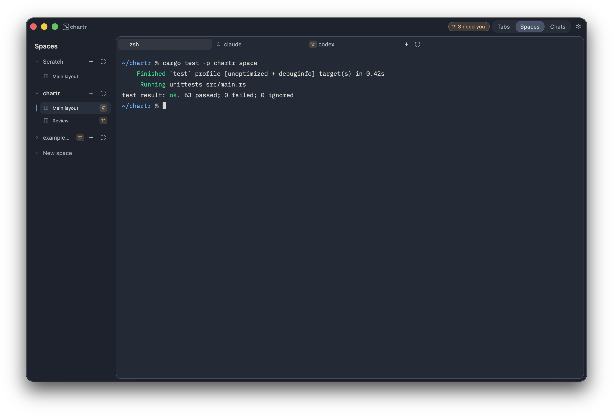
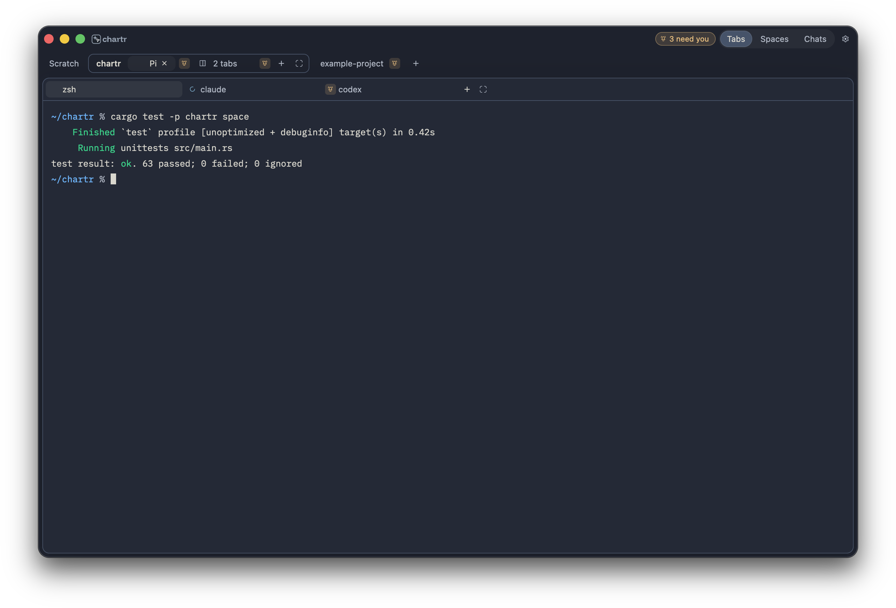
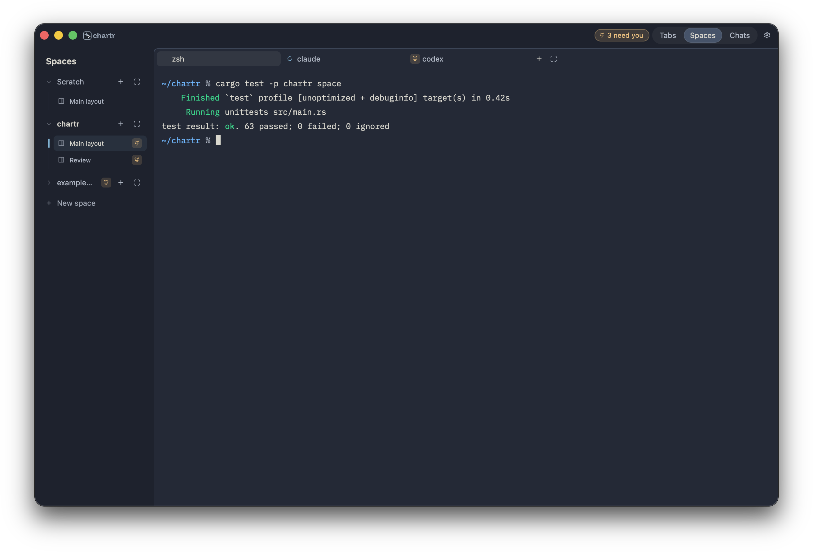
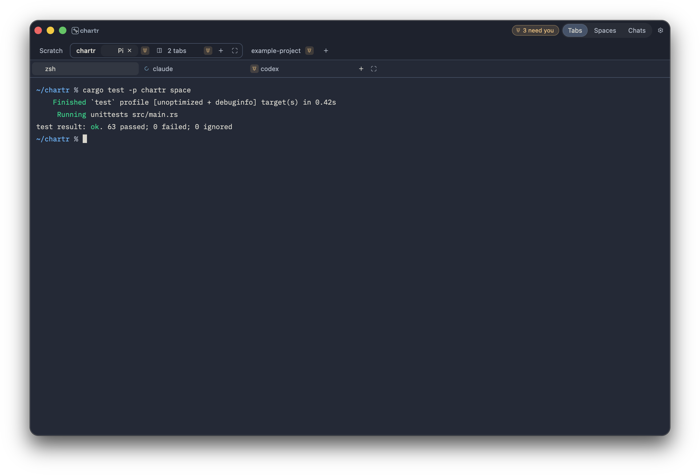
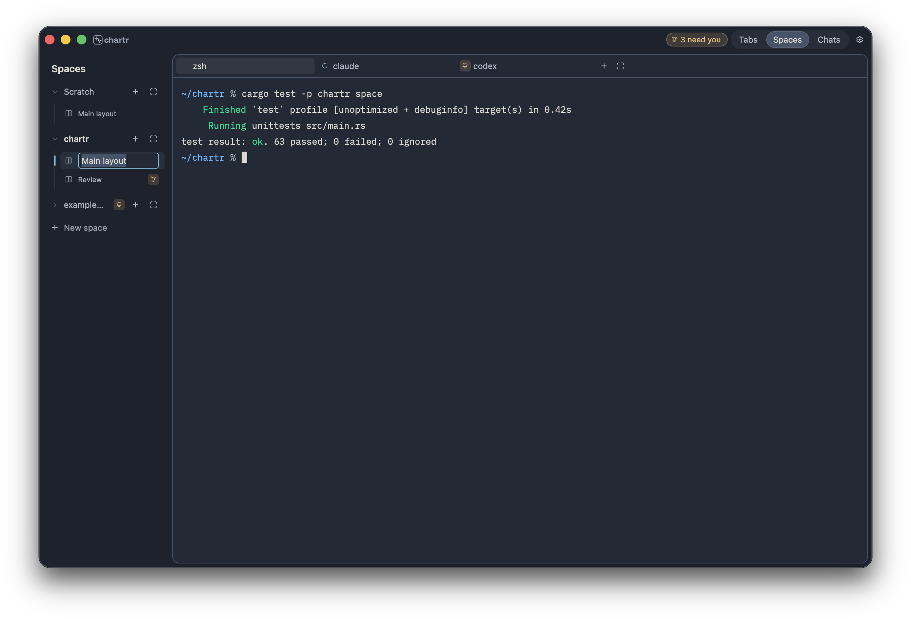
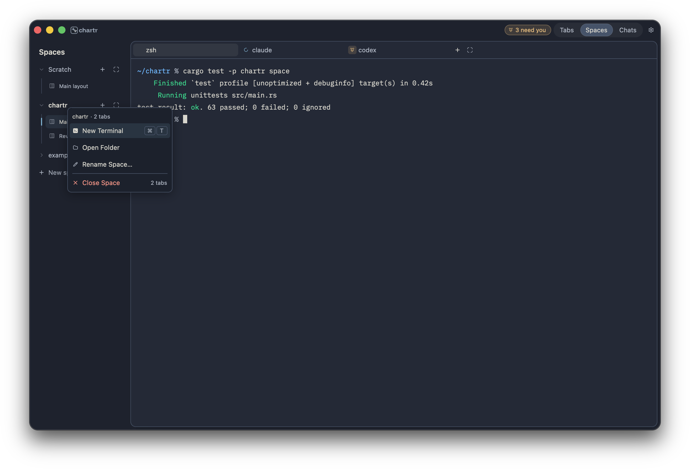

# Chartr Daily

**A heavily customized personal fork of [Chartr](https://github.com/rengwu/chartr).**

I have adapted this native terminal and agent workspace for my own day-to-day
needs, primarily around the **Spaces** view. This is not an official upstream
release or a broadly tested distribution. Expect opinionated choices and rough
edges rather than a supported, general-purpose product.

> **Testing limits:** This fork has only been tested on **macOS**. I also changed
> **Tabs** and **Chats** modes, but neither has been properly tested end to end.
> Linux and Windows have not been verified for this fork. A successful build,
> unit test, or screenshot is not a claim that those workflows work reliably.

Chartr is built with Rust and GPUI, with Zed's terminal stack and Herdr-owned
persistent terminal sessions. It runs locally and does not require a Chartr
account.

- [Build this fork](docs/daily-app-build-and-verify.md)
- [Workspace reference](docs/workspace.md)
- [Chats / Inbox reference](docs/conversations.md)
- [Documentation](docs/README.md)
- [Upstream project and downloads](https://github.com/rengwu/chartr)

 

## What I changed

This is a summary of the customizations, not a complete commit-by-commit changelog.

| Area | Changes in this fork |
| --- | --- |
| **Spaces and sidebar** | A quieter tree of spaces and layouts, revised selection and activity indicators, reordered rows, and **Scratch** for sessions outside a project. |
| **Names and menus** | Custom pane-tab names, inline space/layout renaming, drag ordering, and revised context menus for moving and closing tabs. |
| **Workspace appearance** | An inset or full work surface, rounded pane tabs, a capsule Tabs / Spaces / Chats switch, revised spacing, icons, status markers, and native menu styling. |
| **Tabs mode** | Reworked space-scoped outer tab strip, grouping, and creation controls. **Changed, but not properly tested end to end.** |
| **Chats mode** | Changed history-row and terminal-pane presentation around Inbox and the session's original terminal. **Changed, but not properly tested end to end.** |
| **Workspace recovery** | Autosave/restore preserves names, pane layouts, stable item IDs, and session recovery metadata. Confirmed missing sessions retain ended tabs instead of silently deleting them. |
| **macOS development** | A separately identifiable **Chartr Daily** bundle and a fixture-only screenshot harness. |

The implementation is documented in the [code map](docs/code-map.md),
[visual design guide](docs/visual-design.md), and
[workspace reference](docs/workspace.md).

### Recovery behavior

- Reconnect surviving terminal sessions using their saved identities.
- Keep an ended session's tab and recovery information for **explicit resume**.
- Do **not** automatically launch replacement agents.
- Keep deliberately closed or dismissed tabs closed.

Local regression tests cover save/reload, missing backend snapshots, names,
layouts, session identities, and explicit closes using synthetic temporary data
and display-only terminals. They do **not** establish that a real computer
restart, backend crash, agent resume, or every view transition works end to end.

## Screenshots

These are **synthetic UI-lab captures**, not my live workspace. They render the
current sidebar, tab strip, and menus in the bundled Ayu Mirage theme with generic
example data. The terminal text is static fixture text, and the macOS window
frame is drawn by the capture harness. These images do not demonstrate a working
terminal, or verified Tabs and Chats workflows.

### Spaces view

### Tabs view

### Full work surface

The same views with the **Full** work surface, which runs edge to edge instead of
sitting inset as a card.

### Inline layout naming

### Space context menu

See [capture provenance and reproduction](docs/assets/screenshots/README.md).

## Building and trying it

Build from this checkout; upstream release packages do **not** contain these
customizations. The [Daily build guide](docs/daily-app-build-and-verify.md)
explains the macOS build and the separate steps for staging, installing, and
verifying a bundle. Nothing is installed automatically by the build script.

This fork uses the **same default configuration and state directories as
upstream Chartr**. A different app name or bundle ID does not isolate your
settings, session history, or workspace database. Use a separate test profile
and do not point an unverified build at important live state.

The [acceptance checklist](docs/acceptance.md) describes checks still needed
before making broader support or release claims. It is not a record that the
checks have passed. Linux packaging and other inherited upstream material remain
in the source tree but are unverified here.

My personal plans, local handoffs, session exports, and machine configuration
are not included. Upstream's own planning map and research notes are kept
unchanged as upstream history.

## Upstream and acknowledgements

The original project, releases, and website are maintained by
[Chartr upstream](https://github.com/rengwu/chartr) ([chartr.dev](https://chartr.dev/)).
This fork retains its upstream code, licensing, and acknowledgements.

- [Zed](https://github.com/zed-industries/zed) — GPUI, UI components, themes, and the terminal stack.
- [Herdr](https://github.com/herdrdev/herdr) — persistent terminal sessions.
- [wayfinder-maps](https://github.com/rengwu/wayfinder-maps) — the map CLI and viewer.
- [mattpocock/skills](https://github.com/mattpocock/skills) — the original Wayfinder skill and workflow.
- [@brownoxford](https://github.com/brownoxford) — privately reported vulnerabilities in upstream's localhost trust boundaries.
- [@bradymwilliams](https://github.com/bradymwilliams) — [an upstream report](https://github.com/rengwu/chartr/pull/5) that improved opening monorepo subdirectories.

## Licence

[GPL-3.0-or-later](LICENSE-GPL). See the relevant vendored and asset directories
for their additional licences and attribution.
